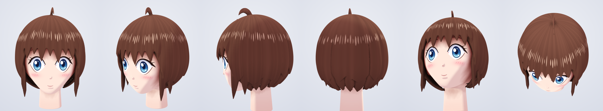

# Anime Head Generator（顔のみ・第1段階）

Tripo のように **3Dメッシュ + テクスチャ** を出力する、アニメ調キャラクターの頭部ジェネレーターです。
外部ライブラリなし（Node.js のみ）で動きます。



## 出力

| ファイル | 内容 |
|---|---|
| `output/anime_head.glb` | glTF 2.0 バイナリ。`Face` と `Hair` の2メッシュで、UV・法線・焼き込みAO（COLOR_0）とテクスチャ埋め込み済み。約24cmスケール（m単位） |
| `output/anime_head_skin.png` | 肌・目・眉・口・チークのアルベドテクスチャ（2048²） |
| `output/anime_head_hair.png` | 髪のアルベドテクスチャ（天使の輪ハイライト込み） |

Blender / Unity / three.js などにそのまま読み込めます。

## 「パペットっぽさ」を避けるためにしていること

- 顔・頭蓋・あご・首・耳は **SDF のスムーズユニオンでひとつの閉じたメッシュ** にしています。パーツの継ぎ目、ヒンジのような口、飛び出した球の目玉はありません。
- 目はアニメ的に **ほぼフラットな浅い窪み** に描き込み、影・ハイライトもテクスチャに入れています。
- 髪は重なった2層のボブと房の溝、尖った毛先でできています。前髪と横髪は **頭の形に沿って垂れるように成長** させ、ねじれないように作っています。
- AO（環境遮蔽）を頂点カラーに焼き込み、前髪の影や首元の陰影を自然に出しています（肌は暖色寄り）。

## おまけ: ブラウザゲーム

`biohazard/` にバイオハザード風のブラウザゲームがあります（[biohazard/README.md](biohazard/README.md)）。

## 使い方

```bash
node src/build.js                 # 出力: output/（--res=0.012 --tex=2048 が目安）
node scripts/render.js            # 確認用のレンダー: output/previews/*.png（Playwright が必要）
npx http-server . -p 8080         # → http://localhost:8080/viewer/index.html?src=/output/anime_head.glb
```

ビューアー（`viewer/index.html`）は依存ライブラリなしの WebGL2 で動き、アニメ調／ライティングの2種類のシェーディングを切り替えられます。「GLB…」ボタンから任意の GLB も開けます。

## 構成

- `src/head.js` 顔の造形（SDF）と髪（シェル＋房の成長）
- `src/mesher.js` ナローバンド SDF サンプリング、Surface Nets、Taubin スムージング
- `src/paint.js` 顔パーツを正面座標で描き、実形状へ投影するテクスチャペインター
- `src/uv.js` 顔の解像度を優先した円筒 UV
- `src/glb.js`, `src/png.js` 依存なしの GLB / PNG ライター

## 次のステップ候補

- 体（首から下）の追加、ボーン／ブレンドシェイプ（表情）の追加
- 髪型・目の色・肌色のプリセット（`DEFAULT_PALETTE` と `makeStrands`）
